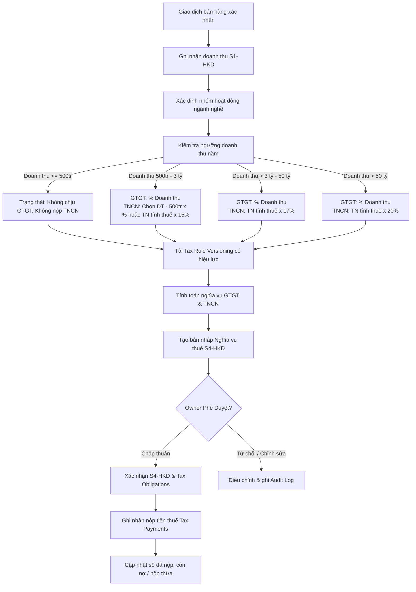

# Quy Định Kế Toán Theo Thông Tư 88/2021/TT-BTC & Chính Sách Thuế Hộ Kinh Doanh (Áp Dụng Từ 2026)

## 1. Tổng Quan & Cơ Sở Pháp Lý

Thông tư số 88/2021/TT-BTC do Bộ Tài chính ban hành ngày 11/10/2021 (có hiệu lực từ 01/01/2022) hướng dẫn chế độ kế toán cho các hộ kinh doanh (HKD), cá nhân kinh doanh nộp thuế theo phương pháp kê khai. Kết hợp với các quy định chính sách thuế đối với hộ, cá nhân kinh doanh áp dụng từ năm 2026, nền tảng được định vị là:

> **Hệ thống hỗ trợ chuyển đổi số và quản trị vận hành cho Hộ kinh doanh (HKD)**, tập trung tự động hóa ghi nhận giao dịch, lập sổ kế toán và hỗ trợ tính toán nghĩa vụ thuế GTGT và TNCN. Hệ thống **không** phải là phần mềm quản lý thuế doanh nghiệp (không quản lý thuế TNDN/CIT) và **không thay thế** vai trò kiểm tra, phê duyệt cuối cùng của Chủ hộ kinh doanh (Owner) hoặc cơ quan thuế có thẩm quyền.

### Vai trò của nền tảng đối với tuân thủ quy định:
1. **Tự động hóa ghi nhận chứng từ & sổ kế toán**: Ghi nhận doanh thu (S1-HKD), quản lý kho (S2-HKD), và theo dõi nghĩa vụ thuế (S4-HKD) từ các giao dịch bán hàng, nhập kho đã được xác nhận.
2. **Hỗ trợ tính toán thuế thông minh (Tax Engine)**: Tính toán thuế GTGT và TNCN dựa trên ngưỡng doanh thu năm, nhóm ngành nghề, phương pháp tính thuế được lựa chọn và phiên bản chính sách thuế có hiệu lực.
3. **Đảm bảo tính toàn vẹn và lịch sử (Audit Trail & Versioning)**: Quản lý phiên bản biểu mẫu, chính sách thuế theo thời gian hiệu lực; lưu vết mọi hành động phê duyệt, từ chối, chỉnh sửa.

---

## 2. Phạm Vi Áp Dụng Loại Sổ Kế Toán Cốt Lõi

Theo yêu cầu nghiệp vụ chuyên biệt của mô hình hộ kinh doanh (như cửa hàng bán lẻ vật liệu xây dựng, đồ kim khí, phụ tùng...), nền tảng triển khai 03 loại sổ kế toán trọng tâm:

1. **Sổ S1-HKD**: Sổ chi tiết doanh thu bán hàng hóa, dịch vụ.
2. **Sổ S2-HKD**: Sổ chi tiết vật liệu, dụng cụ, sản phẩm, hàng hóa.
3. **Sổ S4-HKD**: Sổ theo dõi tình hình thực hiện nghĩa vụ thuế với Ngân sách Nhà nước (NSNN).

---

## 3. Chính Sách Thuế GTGT & TNCN Đối Với Hộ Kinh Doanh (Chính Sách 2026)

Hệ thống **không áp dụng một tỷ lệ thuế cố định** cho mọi hộ kinh doanh trong mọi trường hợp. Việc xác định và tính toán thuế phải căn cứ vào:
1. **Doanh thu năm** của hộ kinh doanh (Annual Revenue Thresholds);
2. **Nhóm ngành nghề / hoạt động kinh doanh** (Tax Activity Group);
3. **Phương pháp tính thuế TNCN** được áp dụng (Revenue-based hoặc Income-based);
4. **Thời điểm hiệu lực** của chính sách thuế (Tax Policy Versioning).

```
Thông tư 88/2021/TT-BTC
       │
       ▼
Sổ kế toán / Dữ liệu kế toán
       │
       ▼
Doanh thu thực tế (Revenue)
       │
       ▼
Nhóm hoạt động tính thuế (Tax Activity Group)
       │
       ▼
Ngưỡng doanh thu năm (Annual Revenue Threshold)
       │
       ▼
Phương pháp tính thuế (Tax Calculation Method)
       │
       ▼
Nghĩa vụ thuế GTGT + TNCN
       │
       ▼
Sổ S4-HKD & Phê duyệt Owner
```

### 3.1. Phân Tầng Ngưỡng Doanh Thu Năm (Revenue Thresholds)

| Doanh thu năm | Thuế GTGT | Thuế TNCN | Ghi chú chính sách |
| :--- | :--- | :--- | :--- |
| **Từ 500 triệu đồng trở xuống** ($\le 500\text{ tr}$) | **Không chịu thuế GTGT** | **Không phải nộp TNCN** | Hệ thống vẫn ghi nhận doanh thu đầy đủ, trạng thái: *NOT SUBJECT TO VAT/PIT* |
| **Trên 500 triệu đến 3 tỷ đồng** ($> 500\text{ tr} - 3\text{ tỷ}$) | Tính theo tỷ lệ % trên doanh thu | Lựa chọn: Phương pháp doanh thu **hoặc** Thu nhập tính thuế (15%) | Chủ hộ có quyền chọn phương pháp tính TNCN phù hợp |
| **Trên 3 tỷ đến 50 tỷ đồng** ($> 3\text{ tỷ} - 50\text{ tỷ}$) | Tính theo tỷ lệ % trên doanh thu | Thu nhập tính thuế $\times$ **17%** | Bắt buộc phương pháp thu nhập tính thuế |
| **Trên 50 tỷ đồng** ($> 50\text{ tỷ}$) | Tính theo tỷ lệ % trên doanh thu | Thu nhập tính thuế $\times$ **20%** | Bắt buộc phương pháp thu nhập tính thuế |

### 3.2. Quy Tắc Tính Thuế Giá Trị Gia Tăng (GTGT)
Đối với hộ kinh doanh có doanh thu trên 500 triệu đồng/năm:
$$\text{Thuế GTGT phải nộp} = \text{Doanh thu tính thuế} \times \text{Tỷ lệ GTGT theo ngành nghề}$$

**Tỷ lệ thuế GTGT theo nhóm ngành kinh doanh:**
* **Phân phối, cung cấp hàng hóa** (Bán lẻ VLXD, kim khí, phụ tùng...): **1.0%**
* **Dịch vụ, xây dựng không bao thầu NVL**: **5.0%**
* **Sản xuất, vận tải, dịch vụ có gắn với hàng hóa, xây dựng có bao thầu NVL**: **3.0%**
* **Hoạt động kinh doanh khác**: **2.0%**

### 3.3. Quy Tắc Tính Thuế Thu Nhập Cá Nhân (TNCN)

#### Trường hợp 1: HKD doanh thu trên 500 triệu đến 3 tỷ đồng và lựa chọn phương pháp tính theo doanh thu (Revenue-based)
$$\text{Doanh thu tính thuế TNCN} = \text{Doanh thu} - 500.000.000\text{ VNĐ}$$
$$\text{Thuế TNCN} = \text{Doanh thu tính thuế TNCN} \times \text{Tỷ lệ TNCN theo ngành nghề}$$

*Tỷ lệ TNCN theo phương pháp doanh thu:*
* **Phân phối, cung cấp hàng hóa**: **0.5%**
* **Dịch vụ, xây dựng không bao thầu NVL**: **2.0%**
* **Sản xuất, vận tải, dịch vụ có gắn với hàng hóa, xây dựng có bao thầu NVL**: **1.5%**
* **Hoạt động kinh doanh khác**: **1.0%**

> [!NOTE]
> Bảng tỷ lệ tổng hợp $1\% \text{ GTGT} + 0.5\% \text{ TNCN} = 1.5\%$ chỉ áp dụng cho ngành phân phối/cung cấp hàng hóa khi HKD đủ điều kiện và lựa chọn phương pháp tính TNCN trên doanh thu vượt ngưỡng 500 triệu. Không phải công thức cố định cho mọi hộ kinh doanh.

#### Trường hợp 2: HKD áp dụng phương pháp tính TNCN trên thu nhập tính thuế (Income-based)
$$\text{Thu nhập tính thuế} = \text{Doanh thu} - \text{Chi phí hợp lý, hợp lệ}$$
$$\text{Thuế TNCN} = \text{Thu nhập tính thuế} \times \text{Thuế suất tương ứng}$$

*Mức thuế suất theo ngưỡng doanh thu năm:*
* Doanh thu $> 500\text{ triệu} \le 3\text{ tỷ}$ (khi chọn phương pháp thu nhập): **15%**
* Doanh thu $> 3\text{ tỷ} \le 50\text{ tỷ}$: **17%**
* Doanh thu $> 50\text{ tỷ}$: **20%**

---

## 4. Phân Tầng Thuế Trong Hệ Thống (3 Tiers of Taxes)

Để đảm bảo phạm vi đồ án tập trung, khả thi nhưng kiến trúc vẫn linh hoạt mở rộng:

```
┌─────────────────────────────────────────────────────────────┐
│ Tầng 1: Thuế Cốt Lõi (Core Scope - Triển khai thực tế)      │
│  - Thuế GTGT (VAT)                                          │
│  - Thuế TNCN của Chủ hộ (PIT)                               │
└─────────────────────────────────────────────────────────────┘
                               ▲
                               │
┌─────────────────────────────────────────────────────────────┐
│ Tầng 2: Thuế Tùy Chọn / Mở Rộng (Configurable / Extensible)  │
│  - Thuế Tiêu thụ đặc biệt (SCT)                             │
│  - Thuế Bảo vệ môi trường (Environmental Tax)               │
│  - Thuế Tài nguyên (Natural Resource Tax)                   │
│  - Thuế Xuất nhập khẩu (Import/Export Tax)                  │
└─────────────────────────────────────────────────────────────┘
                               ▲
                               │
┌─────────────────────────────────────────────────────────────┐
│ Tầng 3: Ngoài Phạm Vi (Out of Scope)                         │
│  - Thuế TNDN (CIT - Thuế của doanh nghiệp, không thuộc HKD) │
│  - Thuế Nhà thầu nước ngoài, Thuế sử dụng đất phi nông nghiệp│
└─────────────────────────────────────────────────────────────┘
```

| Loại Thuế | Trạng thái trong Project | Lý do & Phạm vi |
| :--- | :---: | :--- |
| **GTGT (VAT)** | **Core (Bắt buộc)** | Gắn trực tiếp với mọi hoạt động bán hàng/cung cấp dịch vụ của HKD |
| **TNCN (PIT)** | **Core (Bắt buộc)** | Nghĩa vụ thuế thu nhập bắt buộc của chủ hộ kinh doanh |
| **TTĐB (SCT)** | **Configurable** | Chỉ phát sinh khi HKD kinh doanh một số mặt hàng đặc biệt |
| **BVMT** | **Configurable** | Chỉ phát sinh với hàng hóa thuộc diện chịu thuế môi trường (túi nilon, xăng dầu...) |
| **Thuế tài nguyên** | **Configurable** | Chỉ khi HKD trực tiếp khai thác tài nguyên |
| **Thuế XNK** | **Configurable** | Chỉ khi HKD trực tiếp làm thủ tục xuất nhập khẩu hàng hóa |
| **Thuế TNDN (CIT)** | **Out of Scope** | Đây là thuế dành cho doanh nghiệp/pháp nhân, không áp dụng cho HKD |
| **Thuế đất / Nhà thầu** | **Out of Scope** | Không thuộc luồng nghiệp vụ bán hàng, kho của cửa hàng HKD |

---

## 5. Quy Tắc Tự Động Hóa Kế Toán & Tax Engine

### 5.1. Hạch Toán Doanh Thu (S1-HKD)
- **Sự kiện kích hoạt (Trigger)**: Khi đơn bán hàng được xác nhận hoàn thành (bán trực tiếp tại quầy hoặc đơn nháp do AI đề xuất được Employee/Owner duyệt).
- **Quy tắc xử lý**:
  - Hệ thống bóc tách các mặt hàng trong đơn theo từng danh mục nhóm ngành thuế (`tax_activity_group_id`).
  - Lưu snapshot tỷ lệ thuế và phương pháp tính tại thời điểm bán hàng vào `sales_order_items`.
  - Tự động cộng dồn doanh thu vào cột tương ứng trên **S1-HKD**.
  - Nếu đơn hàng ghi nợ: Cập nhật doanh thu vào **S1-HKD**, đồng thời lưu vết khoản nợ vào Hồ sơ công nợ khách hàng (`customer_debts`, `debt_transactions`).

### 5.2. Hạch Toán Kho & Xuất Hàng (S2-HKD)
- **Sự kiện kích hoạt (Trigger)**: Khi xác nhận Phiếu nhập kho (Import) hoặc Đơn bán hàng thành công (Export).
- **Quy tắc xử lý**:
  - **Nhập kho**: Tăng số lượng tồn, lưu đơn giá nhập, tính tổng giá trị nhập thực tế.
  - **Xuất kho**: Giảm số lượng tồn kho theo đơn vị tính. Đơn giá xuất kho áp dụng phương pháp **Bình quân gia quyền (Weighted Average)** hoặc **FIFO (Nhập trước xuất trước)** tùy cấu hình.
  - **Công thức Bình quân gia quyền cả kỳ dự trữ**:
    $$\text{Đơn giá xuất} = \frac{\text{Giá trị tồn đầu kỳ} + \text{Giá trị nhập trong kỳ}}{\text{Số lượng tồn đầu kỳ} + \text{Số lượng nhập trong kỳ}}$$

### 5.3. Xử Lý Thuế & Hạch Toán Nghĩa Vụ Thuế (S4-HKD Tax Engine)
- **Sự kiện kích hoạt (Trigger)**: Định kỳ (Cuối tháng/Quý/Năm) hoặc khi Chủ hộ yêu cầu tổng hợp nghĩa vụ thuế kỳ báo cáo.
- **Quy trình xử lý của Tax Engine**:



- **Công thức tính tổng hợp trên S4-HKD**:
  - **Số thuế phải nộp trong kỳ**: Do Tax Engine tính toán dựa trên các quy tắc ở mục 3.
  - **Số thuế đã nộp trong kỳ**: Tổng số tiền các lần nộp thuế thực tế có Giấy nộp tiền vào NSNN được Owner xác nhận.
  - **Số thuế còn phải nộp / nộp thừa cuối kỳ**:
    $$\text{Thuế còn phải nộp/nộp thừa} = (\text{Số dư thuế đầu kỳ} + \text{Số thuế phải nộp phát sinh}) - \text{Số thuế đã nộp}$$

---

## 6. Các Ví Dụ Nghiệp Vụ Cụ Thể (Business Cases)

### Case 1: Cửa hàng quy mô nhỏ (Doanh thu năm 400 triệu đồng)
- **Doanh thu năm**: $400.000.000\text{ VNĐ} \le 500.000.000\text{ VNĐ}$
- **Thuế GTGT**: 0 VNĐ
- **Thuế TNCN**: 0 VNĐ
- **Xử lý hệ thống**: Hệ thống vẫn ghi nhận toàn bộ hóa đơn, doanh thu vào S1-HKD và ghi nhận trạng thái nghĩa vụ thuế: `NOT_SUBJECT_TO_TAX`. Dữ liệu doanh thu không bị xóa bỏ.

### Case 2: Cửa hàng VLXD doanh thu 2 tỷ đồng (Chọn phương pháp TNCN trên doanh thu)
- **Doanh thu năm**: $2.000.000.000\text{ VNĐ}$ (Ngành phân phối, cung cấp hàng hóa)
- **Thuế GTGT**:
  $$\text{GTGT} = 2.000.000.000 \times 1\% = 20.000.000\text{ VNĐ}$$
- **Thuế TNCN (Revenue-based)**:
  $$\text{Doanh thu tính thuế TNCN} = 2.000.000.000 - 500.000.000 = 1.500.000.000\text{ VNĐ}$$
  $$\text{TNCN} = 1.500.000.000 \times 0.5\% = 7.500.000\text{ VNĐ}$$
- **Tổng nghĩa vụ thuế**: $20.000.000 + 7.500.000 = 27.500.000\text{ VNĐ}$

### Case 3: Cửa hàng quy mô lớn doanh thu 5 tỷ đồng (Áp dụng phương pháp thu nhập tính thuế)
- **Doanh thu năm**: $5.000.000.000\text{ VNĐ} > 3.000.000.000\text{ VNĐ}$
- **Thuế GTGT**:
  $$\text{GTGT} = 5.000.000.000 \times 1\% = 50.000.000\text{ VNĐ}$$
- **Thuế TNCN (Income-based)**:
  - Giả sử chi phí hợp lý được chấp nhận: $4.000.000.000\text{ VNĐ}$
  - Thu nhập tính thuế: $5.000.000.000 - 4.000.000.000 = 1.000.000.000\text{ VNĐ}$
  - Thuế suất áp dụng ($3\text{ tỷ} - 50\text{ tỷ}$): **17%**
  $$\text{TNCN} = 1.000.000.000 \times 17\% = 170.000.000\text{ VNĐ}$$
- **Tổng nghĩa vụ thuế**: $50.000.000 + 170.000.000 = 220.000.000\text{ VNĐ}$

---

## 7. Ranh Giới Phạm Vi Đồ Án & Xử Lý Dữ Liệu Chi Phí

### 7.1. Phạm vi triển khai trực tiếp
- Tự động hóa bộ 3 sổ cốt lõi: **S1-HKD**, **S2-HKD**, **S4-HKD**.
- Triển khai Tax Engine tính thuế GTGT và TNCN theo đúng chính sách 2026.
- Quản lý phiên bản chính sách thuế (`tax_rules`, `tax_rule_versions`) và biểu mẫu kế toán (`report_templates`, `report_template_versions`).

### 7.2. Ranh giới về dữ liệu chi phí đối với phương pháp TNCN trên thu nhập
- Đồ án tập trung vào quản lý bán hàng, tồn kho và nghĩa vụ thuế, không triển khai toàn diện sổ **S3-HKD** (Sổ chi phí SXKD) hay hệ thống kế toán chi phí doanh nghiệp phức tạp.
- **Quy định xử lý**: Đối với phương pháp TNCN dựa trên thu nhập tính thuế, hệ thống thực hiện tính toán khi có dữ liệu chi phí hợp lệ trong phạm vi hệ thống quản lý (như giá vốn hàng bán từ S2-HKD); các khoản chi phí khác ngoài phạm vi tự động sẽ được xem là dữ liệu đầu vào do Owner xác nhận hoặc nhập bổ sung khi lập báo cáo thuế.

### 7.3. Thuế TNDN (Corporate Income Tax - CIT)
- Thuế TNDN là thuế của doanh nghiệp/công ty, không áp dụng cho hộ kinh doanh.
- Module thuế HKD của đồ án **không chứa** thuế TNDN. Nếu hệ thống mở rộng đối tượng sang Doanh nghiệp trong tương lai, module TNDN sẽ được phát triển như một phân hệ riêng biệt.

---

## 8. Quản Lý Phiên Bản Chính Sách Thuế (Tax Policy Versioning) & Audit Trail

### 8.1. Nguyên tắc quản lý phiên bản chính sách thuế
1. Mỗi quy tắc tính thuế (`tax_rules`) gắn liền với một khoảng thời gian hiệu lực (`effective_from`, `effective_to`).
2. Khi chính sách thuế thay đổi (ví dụ: thay đổi thuế suất hoặc điều chỉnh ngưỡng doanh thu từ năm tài chính mới):
   - Quy tắc cũ được đóng hiệu lực (`effective_to = timestamp`).
   - Quy tắc mới được ban hành (`effective_from = timestamp`, `effective_to = NULL`).
3. **Bảo toàn dữ liệu lịch sử**: Giao dịch phát sinh trong quá khứ luôn giữ nguyên cách tính theo quy tắc thuế có hiệu lực tại thời điểm phát sinh giao dịch. Hệ thống tuyệt đối không dùng quy tắc thuế mới để tính lại giao dịch cũ.

### 8.2. Kiểm soát phê duyệt & Nhật ký hệ thống (Audit Log)
- Mọi báo cáo kế toán (S1, S2, S4) và nghĩa vụ thuế đều ở trạng thái Nháp/Chờ duyệt cho đến khi Owner chính thức phê duyệt.
- Mọi thao tác phê duyệt, từ chối, chỉnh sửa đều được ghi nhận vào `audit_logs` gồm:
  - `user_id`: Người thực hiện;
  - `action`: Hành động (`CREATE`, `UPDATE`, `APPROVE`, `REJECT`);
  - `entity_name`, `entity_id`: Đối tượng tác động;
  - `old_values`, `new_values`: Dữ liệu trước và sau thay đổi;
  - `reason`: Lý do chỉnh sửa/từ chối;
  - `created_at`: Thời điểm thực hiện.

---

## 9. Tuyên Bố Về Tính Hỗ Trợ Của Hệ Thống

> Hệ thống tự động ghi nhận và tổng hợp các giao dịch kinh doanh đã được xác nhận vào các sổ kế toán và báo cáo thuế được hỗ trợ (S1-HKD, S2-HKD, S4-HKD). Hệ thống cung cấp công cụ hỗ trợ tính toán thuế dựa trên các quy tắc cấu hình, nhóm hoạt động kinh doanh, ngưỡng doanh thu và phiên bản chính sách thuế có hiệu lực. Tất cả sổ kế toán và báo cáo thuế tạo ra phải được Chủ hộ kinh doanh (Owner) kiểm tra và phê duyệt trước khi sử dụng cho mục đích kê khai thuế chính thức hoặc các thủ tục pháp lý khác. Hệ thống không thay thế trách nhiệm pháp lý của Chủ hộ kinh doanh và quyền kiểm tra của cơ quan quản lý thuế.