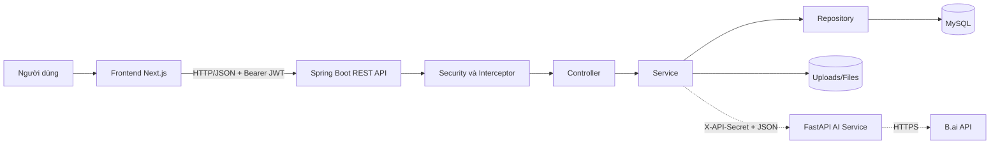
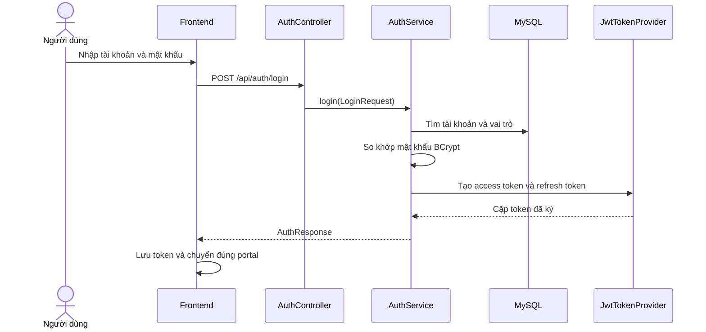
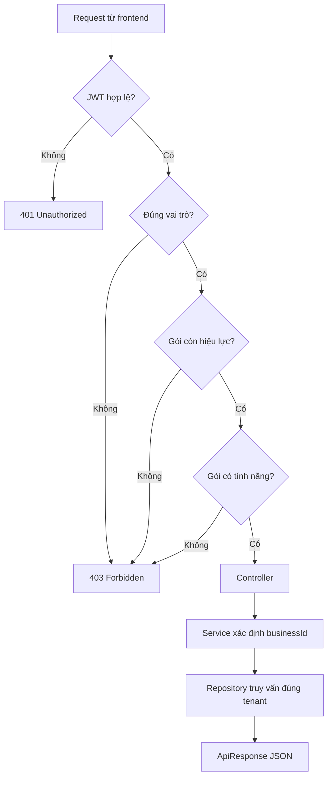
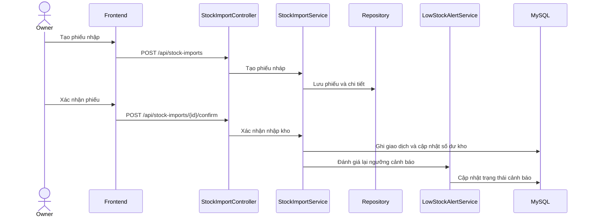
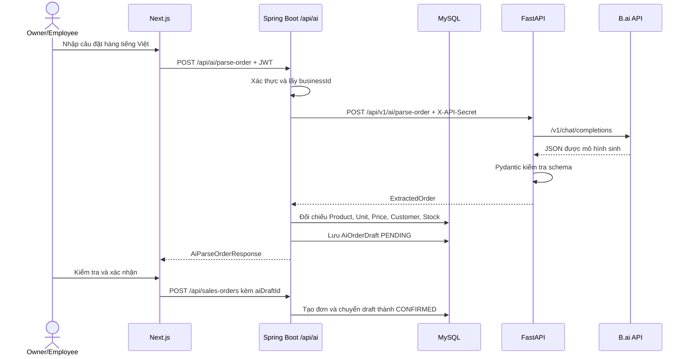

# TÀI LIỆU HIỆN THỰC HỆ THỐNG

## Nền tảng hỗ trợ chuyển đổi số cho hộ kinh doanh

| Thuộc tính | Nội dung |
|---|---|
| Mã tài liệu | HBDT-SI-01 |
| Tên tài liệu | Tài liệu hiện thực hệ thống (System Implementation Document) |
| Dự án | Platform to Support Digital Transformation for Household Businesses |
| Phiên bản | 1.0 |
| Ngày ban hành | 15/09/2026 |
| Trạng thái | Bản bàn giao |
| Đơn vị thực hiện | Nhóm phát triển HBDT |
| Backend | Java 21, Spring Boot 3.3.0 |
| Frontend | Next.js 16, React 19, TypeScript 5 |
| Cơ sở dữ liệu | MySQL 8 |
| Dịch vụ AI | Python, FastAPI |

---

## Lịch sử phiên bản

| Phiên bản | Ngày | Nội dung thay đổi | Người thực hiện |
|---|---|---|---|
| 1.0 | 15/09/2026 | Ban hành tài liệu mô tả hiện thực hệ thống theo mã nguồn bàn giao | Nhóm phát triển HBDT |

## Mục lục

1. [Giới thiệu](#1-giới-thiệu)
2. [Tổng quan giải pháp hiện thực](#2-tổng-quan-giải-pháp-hiện-thực)
3. [Công nghệ và môi trường phát triển](#3-công-nghệ-và-môi-trường-phát-triển)
4. [Tổ chức mã nguồn](#4-tổ-chức-mã-nguồn)
5. [Hiện thực backend](#5-hiện-thực-backend)
6. [Xác thực và phân quyền](#6-xác-thực-và-phân-quyền)
7. [Cô lập dữ liệu theo hộ kinh doanh](#7-cô-lập-dữ-liệu-theo-hộ-kinh-doanh)
8. [Hiện thực frontend](#8-hiện-thực-frontend)
9. [Hiện thực các luồng nghiệp vụ tiêu biểu](#9-hiện-thực-các-luồng-nghiệp-vụ-tiêu-biểu)
10. [Xử lý lỗi và mã trạng thái](#10-xử-lý-lỗi-và-mã-trạng-thái)
11. [Nhật ký, thông báo và tác vụ nền](#11-nhật-ký-thông-báo-và-tác-vụ-nền)
12. [Seed dữ liệu và khởi tạo database](#12-seed-dữ-liệu-và-khởi-tạo-database)
13. [Lưu trữ tệp và tích hợp bên ngoài](#13-lưu-trữ-tệp-và-tích-hợp-bên-ngoài)
14. [Dịch vụ AI](#14-dịch-vụ-ai)
15. [Cấu hình ứng dụng](#15-cấu-hình-ứng-dụng)
16. [Biên dịch, chạy và đóng gói](#16-biên-dịch-chạy-và-đóng-gói)
17. [Kiểm thử hiện thực](#17-kiểm-thử-hiện-thực)
18. [Truy vết từ yêu cầu đến hiện thực](#18-truy-vết-từ-yêu-cầu-đến-hiện-thực)
19. [Giới hạn và hướng cải tiến](#19-giới-hạn-và-hướng-cải-tiến)
20. [Kết luận](#20-kết-luận)
21. [Phụ lục A – Một số nhóm API chính](#phụ-lục-a--một-số-nhóm-api-chính)

## Tóm tắt điều hành

Tài liệu trình bày cách hệ thống được hiện thực từ yêu cầu và thiết kế đã phê duyệt, bao gồm kiến trúc ứng dụng, tổ chức mã nguồn, cơ chế bảo mật, cách xử lý nghiệp vụ, quản lý dữ liệu, cấu hình, build, kiểm thử và đóng gói. Nội dung được đối chiếu trực tiếp với cấu trúc repository để bảo đảm khả năng truy vết giữa tài liệu và mã nguồn.

Baseline bàn giao là mã nguồn trên nhánh `main`. Các module đang được phát triển hoặc chờ tích hợp được ghi chú riêng và không được tính là chức năng đã nghiệm thu trên baseline. Cách trình bày này giúp người đọc phân biệt rõ phần đã sẵn sàng bàn giao với phần mở rộng đang trong quá trình hoàn thiện.

Hệ thống sử dụng kiến trúc web nhiều tầng: Next.js phụ trách giao diện; Spring Boot cung cấp REST API và xử lý nghiệp vụ; MySQL lưu trữ dữ liệu; JWT, RBAC và cơ chế kiểm tra quyền tính năng bảo vệ tài nguyên; FastAPI được sử dụng cho module hỗ trợ AI. Thiết kế ưu tiên tính mô-đun, cô lập dữ liệu theo hộ kinh doanh và khả năng kiểm thử.

---

## 1. Giới thiệu

### 1.1. Mục đích tài liệu

Tài liệu này mô tả cách các yêu cầu nghiệp vụ và bản thiết kế của hệ thống được chuyển thành mã nguồn có thể chạy được. Nội dung tập trung vào cấu trúc chương trình, trách nhiệm của từng lớp, cách các thành phần phối hợp, cơ chế bảo mật, quản lý dữ liệu, xử lý lỗi, kiểm thử và triển khai.

Tài liệu đóng vai trò cầu nối giữa:

- **Software Requirement Specification (SRS):** hệ thống phải làm gì;
- **Architecture Design:** hệ thống được chia thành những thành phần nào;
- **Detailed Design:** dữ liệu, lớp và luồng xử lý được thiết kế ra sao;
- **Source Code:** thiết kế đã được hiện thực cụ thể như thế nào.

### 1.2. Phạm vi hiện thực

Hệ thống phục vụ bốn nhóm người dùng chính:

| Vai trò | Phạm vi sử dụng |
|---|---|
| `ADMIN` | Quản trị tài khoản, gói thuê bao, tính năng và dữ liệu hệ thống |
| `MANAGER` | Theo dõi hộ kinh doanh, hóa đơn dịch vụ và số liệu toàn nền tảng |
| `BUSINESS_OWNER` | Quản lý cửa hàng, nhân viên, sản phẩm, kho, bán hàng, công nợ và báo cáo |
| `EMPLOYEE` | Thực hiện các nghiệp vụ được chủ hộ và gói thuê bao cho phép |

Các nhóm chức năng thuộc baseline `main` gồm xác thực, hồ sơ người dùng, sản phẩm và danh mục, đơn vị tính, giá bán, nhập kho, tồn kho, đơn hàng, thanh toán, công nợ, doanh thu, thông báo, gói thuê bao, quản lý tính năng và quản trị hệ thống. Chức năng nhập đơn bằng AI hiện là module ứng viên tích hợp trên nhánh `feature/AI_Service`; phạm vi và trạng thái được trình bày riêng tại Mục 14.

### 1.3. Tài liệu liên quan

- [User Requirements](../user-requirements/user-requirements.md)
- [Software Requirement Specification](../software-requirement-specification/software-requirement-specification.md)
- [Architecture Design](../architecture-design/architecture-design-document.md)
- [Detailed Design](../detailed-design/detailed-design.md)
- [Database Design](../detailed-design/database-design.md)
- [Testing Document](../testing-documents/test-cases.md)
- [Installation Guide](../installation-guide/installation-guide.md)

### 1.4. Thuật ngữ và từ viết tắt

| Thuật ngữ | Diễn giải |
|---|---|
| API | Giao diện lập trình ứng dụng, được sử dụng để trao đổi dữ liệu giữa frontend và backend |
| DTO | Đối tượng truyền dữ liệu, tách hợp đồng API khỏi Entity lưu trong database |
| JWT | Chuỗi định danh có chữ ký dùng để xác thực người dùng trong mỗi yêu cầu |
| RBAC | Cơ chế phân quyền truy cập dựa trên vai trò người dùng |
| JPA/ORM | Cơ chế ánh xạ Entity Java với bảng dữ liệu quan hệ |
| SSE | Kênh sự kiện một chiều từ server tới trình duyệt theo thời gian thực |
| Tenant | Phạm vi dữ liệu độc lập của một hộ kinh doanh trong hệ thống |
| Baseline | Phiên bản mã nguồn chính thức được chọn làm cơ sở build, kiểm thử và bàn giao |

### 1.5. Quy ước trạng thái hiện thực

| Trạng thái | Ý nghĩa |
|---|---|
| Đã hiện thực | Chức năng đã có trong baseline và có thể truy vết tới mã nguồn |
| Ứng viên tích hợp | Chức năng đã có mã nguồn trên nhánh riêng nhưng chưa thuộc baseline bàn giao |
| Hướng cải tiến | Nội dung được đề xuất cho phiên bản tiếp theo, không thuộc phạm vi nghiệm thu hiện tại |

---

## 2. Tổng quan giải pháp hiện thực

### 2.1. Kiến trúc tổng thể

Hệ thống được hiện thực theo kiến trúc nhiều tầng. Backend áp dụng cách tổ chức **Controller – Service – Repository – Entity**, tương ứng với mô hình MVC mở rộng cho REST API. Frontend Next.js đảm nhiệm lớp trình bày và tương tác; backend Spring Boot xử lý nghiệp vụ; MySQL lưu dữ liệu bền vững. Trên nhánh AI, Spring Boot còn đóng vai trò cổng nghiệp vụ trung gian giữa frontend và FastAPI; FastAPI chỉ trích xuất dữ liệu bằng mô hình B.ai, không tự ghi đơn hàng vào database.



Kiến trúc này tách biệt giao diện, nghiệp vụ và truy cập dữ liệu, giúp từng phần có thể phát triển và kiểm thử độc lập.

### 2.2. Nguyên tắc hiện thực

Hệ thống tuân theo các nguyên tắc chính:

1. **Phân tách trách nhiệm:** Controller tiếp nhận HTTP; Service xử lý nghiệp vụ; Repository thao tác dữ liệu.
2. **Không trả Entity trực tiếp:** dữ liệu API được truyền qua Request/Response DTO.
3. **Xác thực không trạng thái:** backend không lưu HTTP session; mỗi yêu cầu mang JWT.
4. **Phân quyền nhiều lớp:** kiểm tra vai trò, trạng thái gói và quyền tính năng trước khi chạy nghiệp vụ.
5. **Cô lập dữ liệu hộ kinh doanh:** `businessId` được suy ra từ người dùng đã xác thực, không tin giá trị do client tự truyền.
6. **Giao dịch nhất quán:** các nghiệp vụ ghi dữ liệu liên quan được thực hiện trong transaction.
7. **Phản hồi API thống nhất:** kết quả thành công và lỗi đều sử dụng cấu trúc chung.
8. **Cấu hình theo môi trường:** development và production sử dụng profile riêng.

---

## 3. Công nghệ và môi trường phát triển

| Thành phần | Công nghệ | Vai trò trong hệ thống |
|---|---|---|
| Backend | Java 21 | Ngôn ngữ hiện thực nghiệp vụ chính |
| Web API | Spring Boot 3.3.0, Spring Web | Xây dựng REST Controller và xử lý HTTP |
| Bảo mật | Spring Security, JJWT 0.12.6 | Xác thực JWT và phân quyền |
| Persistence | Spring Data JPA, Hibernate | Ánh xạ đối tượng và truy vấn dữ liệu |
| Database | MySQL 8 | Lưu dữ liệu nghiệp vụ |
| Validation | Jakarta Validation | Kiểm tra dữ liệu Request DTO |
| Frontend | Next.js 16.2.11, React 19.2.4 | Giao diện web theo App Router |
| Ngôn ngữ frontend | TypeScript 5 | Kiểm soát kiểu dữ liệu phía client |
| UI | Tailwind CSS 4, Lucide React, Framer Motion | Bố cục, biểu tượng và chuyển động |
| Form | React Hook Form, Zod | Quản lý biểu mẫu và kiểm tra dữ liệu |
| Excel | Apache POI 5.5.1 | Nhập dữ liệu sản phẩm từ `.xlsx` |
| PDF | OpenPDF 2.0.3, jsPDF | Sinh tài liệu PDF ở backend/frontend |
| AI service | Python, FastAPI, B.ai API | Phân tích câu đặt hàng; là module ứng viên tích hợp, chưa thuộc baseline bàn giao |
| Build | Maven, npm | Quản lý dependency và đóng gói |
| Kiểm thử | JUnit 5, Mockito, Spring Security Test | Unit test và controller test |
| Container | Docker, Docker Compose | Đóng gói các thành phần triển khai |

---

## 4. Tổ chức mã nguồn

```text
Platform-to-support-digital-transformation-for-household-businesses/
├── Code/
│   ├── Server/                         # Backend Spring Boot
│   │   ├── src/main/java/com/hbdt/
│   │   │   ├── auth/                   # Đăng nhập, đăng ký, OTP, token
│   │   │   ├── product/                # Sản phẩm, danh mục, đơn vị
│   │   │   ├── inventory/              # Nhập kho, tồn kho, cảnh báo
│   │   │   ├── order/                  # Đơn bán hàng
│   │   │   ├── payment/                # Thanh toán
│   │   │   ├── debt/                   # Công nợ
│   │   │   ├── revenue/                # Sổ và phân tích doanh thu
│   │   │   ├── subscription/           # Gói thuê bao
│   │   │   ├── entitlement/            # Quyền tính năng theo gói
│   │   │   ├── admin/, manager/, owner/, employee/
│   │   │   ├── common/                 # DTO, exception, security, service dùng chung
│   │   │   ├── config/                 # Security, MVC và cấu hình ứng dụng
│   │   │   ├── entity/                 # Entity JPA
│   │   │   └── repository/             # Spring Data Repository
│   │   ├── src/main/resources/         # application properties
│   │   ├── src/test/                    # Kiểm thử backend
│   │   ├── seed/                        # Dữ liệu khởi tạo
│   │   └── pom.xml
│   ├── Client/src/frontend/            # Frontend Next.js
│   │   ├── app/                         # Route, layout, component và API client
│   │   ├── public/                      # Tài nguyên tĩnh
│   │   ├── tests/                       # Kiểm thử view-model
│   │   └── package.json
│   └── AI/                              # Dịch vụ FastAPI
│       ├── src/
│       ├── main.py
│       └── requirements.txt
├── docs/                                # Bộ tài liệu dự án
└── docker-compose.yml
```

Trong backend, một module nghiệp vụ thường có cấu trúc:

```text
module/
├── controller/       # Endpoint REST
├── dto/              # Request và Response
├── service/          # Quy tắc nghiệp vụ
└── ...               # Specification hoặc thành phần chuyên biệt
```

Repository và Entity được dùng chung đặt tại `com.hbdt.repository` và `com.hbdt.entity`.

---

## 5. Hiện thực backend

### 5.1. Controller – lớp tiếp nhận yêu cầu

Controller công bố các REST endpoint bằng `@RestController`, nhận dữ liệu từ path, query string hoặc request body và lấy danh tính người dùng từ `Authentication`.

Trách nhiệm của Controller:

- ánh xạ HTTP method và URL;
- kiểm tra quyền bằng `@PreAuthorize`;
- kích hoạt kiểm tra quyền tính năng bằng `@RequireFeature`;
- kiểm tra định dạng DTO bằng `@Valid`;
- gọi Service phù hợp;
- đóng gói kết quả bằng `ApiResponse<T>` và HTTP status.

Controller không trực tiếp truy cập database và không chứa phép tính nghiệp vụ phức tạp.

Ví dụ đối với sản phẩm:

| Thao tác | Endpoint | Vai trò |
|---|---|---|
| Tìm kiếm sản phẩm | `GET /api/products` | Owner hoặc Employee đã xác thực |
| Xem chi tiết | `GET /api/products/{id}` | Owner hoặc Employee đã xác thực |
| Tạo sản phẩm | `POST /api/products` | Owner |
| Cập nhật sản phẩm | `PUT /api/products/{id}` | Owner |
| Vô hiệu hóa sản phẩm | `DELETE /api/products/{id}` | Owner |
| Tải ảnh sản phẩm | `POST /api/products/{id}/images` | Owner |

### 5.2. DTO – hợp đồng dữ liệu API

Hệ thống sử dụng hai nhóm DTO:

- **Request DTO:** dữ liệu client được phép gửi, ví dụ `ProductRequest`, `CategoryRequest`, `CreatePaymentRequest`.
- **Response DTO:** dữ liệu hệ thống cho phép trả ra, ví dụ `ProductResponse`, `CategoryResponse`, `PaymentResponse`.

DTO giúp:

- không làm lộ toàn bộ cấu trúc Entity và quan hệ database;
- ngăn client tự gán các trường nhạy cảm như `businessId`;
- đặt validation sát với hợp đồng API;
- duy trì phản hồi ổn định khi Entity thay đổi;
- tránh vòng lặp serialize từ quan hệ JPA.

Mọi phản hồi JSON chuẩn được bọc bởi:

```json
{
  "success": true,
  "message": "Tạo sản phẩm thành công",
  "data": {
    "id": 15,
    "productCode": "SP015",
    "productName": "Sản phẩm mẫu",
    "status": "ACTIVE"
  }
}
```

Khi có lỗi:

```json
{
  "success": false,
  "message": "Mã sản phẩm đã tồn tại"
}
```

### 5.3. Service – lớp nghiệp vụ

Service là trung tâm xử lý nghiệp vụ. Tùy chức năng, Service thực hiện các bước:

1. Xác định người dùng và `businessId` hiện tại.
2. Chuẩn hóa dữ liệu đầu vào.
3. Kiểm tra sự tồn tại và quyền sở hữu dữ liệu.
4. Kiểm tra ràng buộc nghiệp vụ như trùng mã, trạng thái và số lượng.
5. Đọc hoặc ghi dữ liệu qua Repository.
6. Cập nhật các dữ liệu liên quan trong cùng transaction.
7. Chuyển Entity thành Response DTO.

Các phương thức ghi nhiều bảng được đánh dấu `@Transactional` để bảo đảm hoặc thành công toàn bộ, hoặc rollback toàn bộ khi xảy ra lỗi.

### 5.4. Repository – lớp truy cập dữ liệu

Repository kế thừa `JpaRepository` để cung cấp các thao tác chuẩn như `save`, `findById`, `findAll` và `delete`. Những truy vấn nghiệp vụ được khai báo bằng query method, `@Query` hoặc Specification.

Đối với dữ liệu của hộ kinh doanh, truy vấn luôn kết hợp định danh bản ghi với `businessId`, ví dụ:

```java
Optional<Product> findByIdAndBusinessId(Long id, Long businessId);
```

Cách truy vấn này ngăn một người dùng lấy bản ghi của hộ kinh doanh khác chỉ bằng cách thay đổi ID trên URL.

### 5.5. Entity – ánh xạ dữ liệu

Entity đại diện cho các bảng nghiệp vụ trong MySQL. Các nhóm dữ liệu chính gồm:

- người dùng, vai trò và hồ sơ hộ kinh doanh;
- sản phẩm, danh mục, đơn vị, giá và ảnh;
- số dư kho, giao dịch kho và phiếu nhập;
- khách hàng, đơn hàng, chi tiết đơn và thanh toán;
- công nợ, sổ doanh thu và sổ kế toán;
- gói thuê bao, tính năng và ánh xạ gói–tính năng;
- thông báo, phản hồi, báo cáo và nhật ký thao tác.

Trong môi trường phát triển, Hibernate sử dụng `ddl-auto=update`. Trong production, hệ thống sử dụng `ddl-auto=validate` để tránh tự ý thay đổi schema.

---

## 6. Xác thực và phân quyền

### 6.1. Đăng nhập và phát hành JWT

Luồng đăng nhập được hiện thực như sau:



Mật khẩu được mã hóa bằng `BCryptPasswordEncoder`. JWT được ký bằng khóa cấu hình `jwt.secret`. Theo cấu hình mặc định:

- access token có thời hạn 900.000 ms, tương đương 15 phút;
- refresh token có thời hạn 604.800.000 ms, tương đương 7 ngày.

### 6.2. Xác thực mỗi request

Khi frontend gọi API cần bảo vệ, `apiClient` gắn header:

```http
Authorization: Bearer <access-token>
```

`JwtAuthenticationFilter` thực hiện:

1. Đọc Bearer token từ header `Authorization`.
2. Kiểm tra chữ ký và hạn sử dụng.
3. Lấy username từ trường subject.
4. Nạp lại người dùng và quyền từ database.
5. Đưa đối tượng Authentication vào `SecurityContext`.
6. Chuyển request đến các lớp kiểm tra tiếp theo.

Backend sử dụng `SessionCreationPolicy.STATELESS`, do đó không phụ thuộc HTTP session.

### 6.3. Kiểm soát quyền theo vai trò

`SecurityConfig` bảo vệ URL cấp cao, còn `@PreAuthorize` bảo vệ Controller hoặc từng thao tác.

Ví dụ, Employee có thể xem danh sách sản phẩm nhưng chỉ Owner được tạo, sửa hoặc vô hiệu hóa sản phẩm. API `/api/admin/**` chỉ dành cho `ADMIN`; `/api/manager/**` chỉ dành cho `MANAGER`.

### 6.4. Kiểm tra gói thuê bao

`SubscriptionInterceptor` chặn các nhóm API nghiệp vụ. Đối với Owner và Employee, hệ thống:

1. Xác định hộ kinh doanh từ người dùng đăng nhập.
2. Lấy gói thuê bao hiện tại.
3. Kiểm tra gói có tồn tại và còn khả dụng hay không.
4. Cho phép xử lý hoặc trả `403 Forbidden` với lý do cụ thể.

Employee sử dụng gói thuê bao của hộ kinh doanh mà mình đang trực thuộc.

### 6.5. Kiểm tra quyền tính năng

Các Controller cần giới hạn theo gói được đánh dấu bằng `@RequireFeature`, ví dụ `PRODUCT_MANAGEMENT`. `FeatureEntitlementInterceptor` đọc annotation này, lấy `businessId` từ người dùng đã xác thực và kiểm tra gói hiện tại có cung cấp tính năng hay không.

Client không được tự gửi `featureCode`, `planId` hoặc `businessId` để quyết định quyền. Đây là quyết định bảo mật được thực hiện hoàn toàn ở backend.

### 6.6. Chuỗi kiểm soát một yêu cầu nghiệp vụ



---

## 7. Cô lập dữ liệu theo hộ kinh doanh

Hệ thống là ứng dụng nhiều hộ kinh doanh dùng chung nền tảng. Dữ liệu được phân vùng logic bằng `businessId`.

`BusinessContextService` lấy username từ `Authentication`, tìm User trong database và trả về `businessId` của tài khoản. Nếu tài khoản chưa gắn với hộ kinh doanh, Service dừng xử lý.

Nguyên tắc bắt buộc:

- không sử dụng `businessId` do frontend truyền để quyết định phạm vi dữ liệu;
- mọi truy vấn dữ liệu nghiệp vụ phải có điều kiện `businessId`;
- khi lấy dữ liệu theo ID, dùng cả `id` và `businessId`;
- kiểm tra các thực thể tham chiếu như Category, Product, Customer và SalesOrder cùng tenant;
- Employee được ánh xạ vào cùng `businessId` với Owner.

Ví dụ, khi người dùng yêu cầu cập nhật sản phẩm `id=15`, Service không gọi `findById(15)` đơn thuần mà tìm bản ghi thỏa cả `id=15` và `businessId` hiện tại. Vì vậy ID hợp lệ của tenant khác vẫn được xử lý như không tìm thấy.

---

## 8. Hiện thực frontend

### 8.1. Tổ chức giao diện

Frontend sử dụng Next.js App Router. Các portal được tách theo route:

| Route | Đối tượng |
|---|---|
| `/admin/**` | Quản trị viên hệ thống |
| `/manager/**` | Manager |
| `/owner/**` | Chủ hộ kinh doanh |
| `/employee/**` | Nhân viên |

Mỗi khu vực sử dụng layout riêng để tổ chức menu, tiêu đề, thông tin tài khoản và kiểm soát quyền truy cập phía giao diện.

### 8.2. API Client dùng chung

`app/lib/apiClient.ts` cung cấp các hàm `get`, `post`, `put`, `patch`, `delete` và `upload`. Thành phần này chịu trách nhiệm:

- gắn access token vào request;
- chuyển object thành JSON;
- giữ nguyên `FormData` khi upload;
- lấy trường `data` từ cấu trúc `ApiResponse`;
- phân biệt lỗi `401` và `403`;
- tự làm mới access token khi nhận `401`;
- xóa phiên và chuyển về trang đăng nhập nếu refresh thất bại.

Khi nhiều request cùng gặp token hết hạn, client chỉ phát một yêu cầu refresh và cho các request còn lại chờ token mới, hạn chế gửi refresh lặp lại.

### 8.3. Quản lý phiên và vai trò

Dữ liệu xác thực được lưu vào `sessionStorage` và `localStorage`; cookie `auth_token` và `auth_role` hỗ trợ lớp bảo vệ route. Thay đổi đăng nhập, đăng xuất hoặc refresh token được đồng bộ giữa các tab qua `BroadcastChannel` và storage event.

Sau đăng nhập, frontend điều hướng theo vai trò:

- `ADMIN` → `/admin`;
- `MANAGER` → `/manager`;
- `BUSINESS_OWNER` → portal Owner hoặc bước onboarding;
- `EMPLOYEE` → giao diện nghiệp vụ nhân viên.

Kiểm tra ở frontend giúp cải thiện trải nghiệm nhưng không thay thế kiểm tra bảo mật ở backend.

### 8.4. Trạng thái giao diện

Mỗi màn hình nghiệp vụ cần xử lý tối thiểu bốn trạng thái:

1. **Loading:** đang đợi API.
2. **Success:** có dữ liệu và hiển thị nội dung.
3. **Empty:** yêu cầu thành công nhưng chưa có dữ liệu.
4. **Error:** API từ chối hoặc hệ thống gặp lỗi.

Các form kiểm tra dữ liệu ở client để phản hồi nhanh, sau đó backend tiếp tục kiểm tra bằng DTO validation và quy tắc nghiệp vụ.

---

## 9. Hiện thực các luồng nghiệp vụ tiêu biểu

### 9.1. CRUD sản phẩm và danh mục

#### Tạo sản phẩm

1. Owner nhập thông tin và nhấn **Thêm sản phẩm**.
2. Frontend tạo `ProductRequest` và gọi `POST /api/products`.
3. JWT filter xác thực tài khoản.
4. Spring Security kiểm tra vai trò Owner.
5. Interceptor kiểm tra gói thuê bao và tính năng `PRODUCT_MANAGEMENT`.
6. Controller dùng `@Valid` để kiểm tra cấu trúc request.
7. Service lấy `businessId` từ tài khoản đăng nhập.
8. Service kiểm tra mã sản phẩm trong phạm vi hộ kinh doanh, Category, Unit và các ràng buộc số lượng.
9. Repository lưu Product và cấu hình đơn vị cơ sở.
10. Service đồng bộ số dư tồn kho ban đầu và đánh giá cảnh báo tồn kho.
11. Entity được chuyển thành `ProductResponse`.
12. Controller trả `201 Created` và JSON cho frontend.

#### Cập nhật sản phẩm

Luồng cập nhật sử dụng `PUT /api/products/{id}`. Service tìm sản phẩm bằng `id` và `businessId`, bỏ qua chính sản phẩm hiện tại khi kiểm tra trùng mã, cập nhật các trường hợp lệ, lưu thay đổi và trả `ProductResponse` mới.

#### Xóa sản phẩm

API `DELETE /api/products/{id}` thực hiện **vô hiệu hóa** thay vì xóa vật lý. Cách này giữ được lịch sử đơn hàng, kho và báo cáo đã tham chiếu đến sản phẩm.

Danh mục áp dụng cùng cấu trúc CRUD qua `/api/categories`. Quy tắc tenant, kiểm tra trùng mã/tên và Response DTO được xử lý ở Service.

### 9.2. Nhập kho, tồn kho và cảnh báo tồn kho



Số dư hiện tại được đọc từ `/api/inventory/balances`. Lịch sử nhập, xuất và điều chỉnh được lưu thành giao dịch kho. Cảnh báo tồn kho được cung cấp qua:

- `GET /api/inventory/low-stock/alerts`;
- `GET /api/inventory/low-stock/summary`;
- `GET /api/inventory/low-stock/thresholds`;
- `PUT /api/inventory/low-stock/thresholds/{productId}`.

Service đánh giá lại cảnh báo khi số lượng thay đổi hoặc khi người dùng cập nhật ngưỡng. Dữ liệu cảnh báo luôn được giới hạn theo `businessId`.

### 9.3. Đơn hàng, thanh toán và công nợ

Khi tạo hoặc xác nhận đơn hàng, hệ thống tính tổng tiền, số đã thanh toán và số còn nợ. Nếu phát sinh nợ, đơn hàng phải gắn với khách hàng. Các biến động công nợ được ghi thành `DebtTransaction` để có lịch sử truy vết.

Khi thanh toán:

1. Controller nhận `CreatePaymentRequest` tại `POST /api/payments`.
2. Service khóa/đọc đơn hàng và khách hàng đúng tenant.
3. Kiểm tra trạng thái đơn, số tiền dương và không vượt số nợ.
4. Lưu lịch sử thanh toán.
5. Giảm nợ của đơn hàng và khách hàng.
6. Ghi giao dịch công nợ loại thanh toán.
7. Cập nhật trạng thái `UNPAID`, `PARTIALLY_PAID` hoặc `PAID`.
8. Trả `PaymentResponse`.

Khi hủy đơn có nợ, hệ thống thực hiện giao dịch đảo nợ để giữ lịch sử thay vì xóa dấu vết kế toán.

### 9.4. Phân tích mặt hàng bán chạy

Frontend gọi:

```http
GET /api/revenue-ledger/products
    ?fromDate=2026-09-01
    &toDate=2026-09-30
    &mode=BEST
    &limit=10
```

Service thực hiện:

1. Xác định `businessId` của Owner.
2. Kiểm tra khoảng ngày, chế độ xếp hạng và giới hạn kết quả.
3. Tổng hợp số lượng đã bán từ dữ liệu đơn hàng hợp lệ.
4. Sắp xếp giảm dần với `BEST` hoặc tăng dần với chế độ bán ít.
5. Giới hạn số dòng và trả danh sách `ProductSalesRow`.

### 9.5. Biểu đồ doanh thu

API biểu đồ:

```http
GET /api/revenue-ledger/chart
    ?fromDate=2026-09-01
    &toDate=2026-09-30
    &groupBy=DAY
```

`groupBy` hỗ trợ `DAY`, `WEEK`, `MONTH` và `YEAR`. Service kiểm tra khoảng ngày, giới hạn tối đa 10 năm và không tạo quá 366 mốc. Sau đó Service:

- xác định tenant;
- đồng bộ đơn đã xác nhận còn thiếu vào sổ doanh thu;
- tổng hợp doanh thu theo ngày từ Repository;
- gom các ngày vào mốc tuần, tháng hoặc năm;
- chèn mốc doanh thu bằng 0 cho khoảng không có dữ liệu;
- tính `totalRevenue` và trả danh sách điểm cho biểu đồ.

### 9.6. Gói thuê bao và quyền tính năng

Admin quản lý gói tại `/api/admin/subscription-plans`. Các tính năng hệ thống được quản lý và ánh xạ vào gói thông qua module entitlement. Owner xem gói hiện tại tại `/api/owner/subscriptions/current`.

Khi Owner hoặc Employee gọi một chức năng có `@RequireFeature`, quyền sử dụng được xác định động từ gói đang hoạt động. Vì vậy giao diện có thể ẩn tính năng không được cấp, đồng thời backend vẫn chặn nếu người dùng cố gọi API trực tiếp.

---

## 10. Xử lý lỗi và mã trạng thái

`GlobalExceptionHandler` chuyển exception thành phản hồi nhất quán:

| HTTP status | Trường hợp |
|---|---|
| `400 Bad Request` | Dữ liệu hoặc quy tắc nghiệp vụ không hợp lệ |
| `401 Unauthorized` | Sai thông tin đăng nhập, token thiếu/hết hạn hoặc tài khoản không hợp lệ |
| `403 Forbidden` | Sai vai trò, gói không khả dụng hoặc thiếu quyền tính năng |
| `404 Not Found` | Không tìm thấy tài nguyên trong phạm vi tenant |
| `409 Conflict` | Trạng thái hiện tại không cho phép thực hiện thao tác |
| `413 Payload Too Large` | File tải lên vượt giới hạn |
| `429 Too Many Requests` | Vượt giới hạn đăng nhập hoặc gửi OTP |
| `500 Internal Server Error` | Lỗi chưa được dự đoán; không trả stack trace cho client |

Lỗi validation trả thêm bản đồ tên trường và thông báo để frontend hiển thị đúng vị trí.

---

## 11. Nhật ký, thông báo và tác vụ nền

### 11.1. Audit log

`AuditLoggingFilter` theo dõi các request làm thay đổi dữ liệu: `POST`, `PUT`, `PATCH` và `DELETE`. Sau khi nghiệp vụ thành công, filter ghi lại người thực hiện và thông tin request. Lỗi ghi audit không làm biến một nghiệp vụ đã thành công thành thất bại.

### 11.2. Thông báo thời gian thực

Module notification hỗ trợ:

- lấy danh sách thông báo;
- đếm thông báo chưa đọc;
- đánh dấu đã đọc;
- nhận luồng thông báo bằng Server-Sent Events tại `/api/notifications/stream`.

### 11.3. Tác vụ theo lịch

`@EnableScheduling` được kích hoạt để phục vụ các công việc như dọn OTP hết hạn và kiểm tra vòng đời gói thuê bao. `@EnableAsync` hỗ trợ tác vụ gửi email không đồng bộ.

---

## 12. Seed dữ liệu và khởi tạo database

### 12.1. Cơ chế tạo schema

Trong profile `dev`, JDBC URL có `createDatabaseIfNotExist=true` và Hibernate dùng `ddl-auto=update`. Nếu tài khoản MySQL có đủ quyền, database và các bảng còn thiếu được tạo/cập nhật khi ứng dụng khởi động.

Trong profile `prod`, Hibernate chỉ `validate` schema. Thay đổi cấu trúc production cần được quản lý bằng migration có version.

### 12.2. Cơ chế seed

`SeedRunner` nhận danh sách các `DataSeeder`, sắp xếp theo `order` rồi chạy lần lượt. Mỗi seeder chịu trách nhiệm cho một nhóm dữ liệu tham chiếu hoặc dữ liệu mẫu. Nếu một seeder lỗi, hệ thống ghi log, bỏ qua seeder đó và tiếp tục các seeder còn lại.

Các nguyên tắc sử dụng seed:

- role tham chiếu được bật mặc định;
- tài khoản demo phải được bật rõ ràng trong môi trường development;
- dữ liệu seed nằm trong `Code/Server/seed`;
- không đưa khóa bí mật hoặc mật khẩu production vào file seed;
- sau khởi động phải kiểm tra log để xác nhận các seeder cần thiết đã chạy thành công.

Seed giúp chuẩn bị môi trường demo, nhưng không thay thế migration schema và không được xem là nguồn dữ liệu production.

---

## 13. Lưu trữ tệp và tích hợp bên ngoài

Ảnh đại diện, logo cửa hàng và ảnh sản phẩm được nhận dưới dạng multipart. Backend kiểm tra dung lượng, loại tệp và lưu vào thư mục upload. URL `/uploads/**` được ánh xạ đến thư mục lưu trữ bởi `WebConfig`.

Database chỉ lưu thông tin tham chiếu tới tệp; không lưu toàn bộ ảnh dạng Base64. Khi triển khai production, `UPLOAD_DIR` phải trỏ tới persistent volume hoặc dịch vụ object storage để dữ liệu không mất khi container được tạo lại.

Email OTP sử dụng Spring Mail. Ở development có thể bật `OTP_DEV_MODE` để in OTP ra log; production phải tắt chế độ này và cung cấp thông tin SMTP qua biến môi trường.

---

## 14. Dịch vụ AI

### 14.1. Phạm vi và trạng thái hiện thực

Module AI được quản lý tách biệt để không làm sai lệch phạm vi của bản bàn giao chính thức:

| Phạm vi | Trạng thái | Cách ghi nhận trong tài liệu |
|---|---|---|
| Baseline `main` | Có cấu trúc khởi tạo cho AI service, chưa bao gồm luồng AI hoàn chỉnh | Không tính vào chức năng đã nghiệm thu |
| Nhánh `feature/AI_Service` | Đã hiện thực luồng từ giao diện, backend đến dịch vụ AI và đơn nháp | Ghi nhận là ứng viên tích hợp |
| Bản phát hành | Chờ hợp nhất vào baseline và kiểm thử tích hợp trong môi trường bàn giao | Chỉ công bố hoàn thành sau khi đạt tiêu chí phát hành |

Các Mục 14.2–14.6 mô tả thiết kế hiện thực của module ứng viên tích hợp. Nội dung này cung cấp khả năng truy vết kỹ thuật, nhưng không được hiểu là xác nhận module AI đã thuộc baseline `main`.

### 14.2. Các thành phần hiện thực

Nhánh AI bổ sung ba lớp tích hợp:

1. **Frontend:** `AiOrderInput.tsx` cho Owner/Employee nhập câu tiếng Việt, xem gợi ý, tải lại đơn nháp, đưa gợi ý vào giỏ hoặc từ chối.
2. **Spring Boot:** `/api/ai/**` xác thực người dùng, xác định `businessId`, đối chiếu dữ liệu thật, lưu đơn nháp và kết nối với luồng tạo SalesOrder.
3. **FastAPI:** `/api/v1/ai/**` gọi B.ai để trích xuất dữ liệu có cấu trúc; không truy cập MySQL và không tự tạo đơn.



### 14.3. Trích xuất bằng B.ai

FastAPI dùng `BaiClient` gọi endpoint `/v1/chat/completions`. Prompt yêu cầu mô hình chỉ trả JSON theo schema và không tự tạo ID, giá hoặc dữ liệu nghiệp vụ. Kết quả được Pydantic kiểm tra với các ràng buộc:

- intent chỉ nhận `CREATE_ORDER` hoặc `OTHER`;
- phương thức thanh toán chỉ nhận `CASH`, `TRANSFER`, `DEBT` hoặc `UNKNOWN`;
- tối đa 20 dòng hàng và 20 nội dung chưa rõ;
- số lượng phải lớn hơn 0, tối đa 3 chữ số thập phân;
- câu đầu vào dài tối đa 4.000 ký tự;
- phản hồi sai schema, bị cắt ngắn hoặc không hoàn chỉnh sẽ bị từ chối.

Service nhận biết lỗi API key, hết hạn mức, timeout, model sai và đầu ra không hợp lệ. Thông tin lỗi thô của nhà cung cấp không được trả cho client.

### 14.4. Đối chiếu với dữ liệu nghiệp vụ

AI chỉ làm nhiệm vụ trích xuất. `AiService` của Spring Boot mới quyết định gợi ý có dùng được hay không:

1. Xác định `businessId` từ tài khoản đăng nhập trước khi thực hiện lượt gọi AI có phí.
2. Tìm sản phẩm đang hoạt động trong đúng cửa hàng theo tên hoặc mã.
3. Không tự chọn nếu có nhiều sản phẩm phù hợp.
4. Ghép đơn vị được nói với đơn vị đã cấu hình; nếu người dùng không nói đơn vị thì dùng đơn vị cơ sở hợp lệ.
5. Gọi `ProductPricingService` để lấy giá thật; mô hình không được tự tính giá.
6. Cộng tổng lượng yêu cầu theo sản phẩm và kiểm tra tồn kho.
7. Tìm khách hàng trong đúng tenant; có thể đánh dấu cần tạo khách hàng mới nếu không có kết quả phù hợp duy nhất.
8. Chỉ đặt `readyToApply=true` khi không còn vấn đề cần người dùng xử lý.

### 14.5. Vòng đời đơn nháp

Đơn nháp được lưu vào `ai_order_drafts` với `businessId`, người tạo, câu nguồn, JSON đề xuất và trạng thái:

```text
PENDING ── xác nhận tạo đơn ──> CONFIRMED
    └────── từ chối + lý do ──> REJECTED
```

Khi tạo SalesOrder kèm `aiDraftId`, backend kiểm tra draft còn `PENDING` và thuộc cùng `businessId`. Toàn bộ tạo đơn, xuất kho, ghi doanh thu, ghi công nợ, ghi sổ kế toán và cập nhật draft chạy trong transaction. Nếu một bước thất bại, transaction rollback.

### 14.6. API của module AI

| API Spring Boot | Mục đích |
|---|---|
| `POST /api/ai/parse-order` | Phân tích câu và lưu đề xuất đơn nháp |
| `GET /api/ai/drafts` | Lấy tối đa 50 draft `PENDING` của hộ kinh doanh |
| `POST /api/ai/drafts/{id}/reject` | Từ chối draft và ghi lý do |
| `POST /api/ai/draft-bookkeeping` | Sinh nhận xét từ số liệu báo cáo do backend tính sẵn |
| `GET /api/ai/health` | Kiểm tra trạng thái cấu hình tích hợp AI |

| API FastAPI nội bộ | Mục đích |
|---|---|
| `POST /api/v1/ai/parse-order` | Trích xuất câu đặt hàng qua B.ai |
| `POST /api/v1/ai/draft-bookkeeping` | Viết nhận xét trên số liệu đã tính sẵn |
| `GET /api/v1/ai/ready` | Kiểm tra cấu hình mà không tiêu tốn lượt gọi provider |
| `GET /health` | Kiểm tra process FastAPI đang chạy |

Các API nghiệp vụ FastAPI yêu cầu `X-API-Secret`. `BAI_API_KEY` chỉ được đặt tại AI service; Spring Boot không nhận khóa nhà cung cấp.

---

## 15. Cấu hình ứng dụng

Các biến môi trường quan trọng:

| Biến | Mục đích |
|---|---|
| `SPRING_PROFILES_ACTIVE` | Chọn profile `dev` hoặc `prod` |
| `SERVER_PORT` | Cổng backend, mặc định 8080 |
| `DB_HOST`, `DB_PORT` | Máy chủ và cổng MySQL |
| `DB_NAME` | Tên database |
| `DB_USERNAME`, `DB_PASSWORD` | Tài khoản database |
| `JWT_SECRET` | Khóa ký JWT; bắt buộc thay ở production |
| `JWT_ACCESS_EXPIRATION_MS` | Thời hạn access token |
| `JWT_REFRESH_EXPIRATION_MS` | Thời hạn refresh token |
| `MAIL_HOST`, `MAIL_PORT` | Máy chủ SMTP |
| `MAIL_USERNAME`, `MAIL_PASSWORD` | Tài khoản gửi OTP |
| `OTP_DEV_MODE` | Cho phép in OTP ra log khi phát triển |
| `UPLOAD_DIR` | Thư mục lưu file tải lên |
| `APP_PUBLIC_BASE_URL` | Base URL công khai dùng tạo liên kết file |
| `SEED_DIR` | Ghi đè đường dẫn dữ liệu seed |
| `AI_SERVICE_URL` | Địa chỉ FastAPI mà Spring Boot gọi |
| `AI_SERVICE_API_SECRET` | Secret dùng chung giữa Spring Boot và FastAPI |
| `AI_SERVICE_TIMEOUT_SECONDS` | Thời gian chờ AI service |
| `AI_SERVICE_AUTO_START` | Cho phép backend tự chạy FastAPI ở development |
| `BAI_API_KEY` | Khóa B.ai, chỉ cấu hình trong AI service |
| `BAI_MODEL`, `BAI_BASE_URL` | Model và địa chỉ B.ai API |

Tệp `.env` chứa thông tin thật không được đưa vào repository. Secret của môi trường bàn giao phải được cấp qua biến môi trường hoặc cơ chế quản lý secret chuyên dụng.

---

## 16. Biên dịch, chạy và đóng gói

### 16.1. Backend

```powershell
cd Code\Server
.\mvnw.cmd clean test
.\mvnw.cmd spring-boot:run
```

Đóng gói:

```powershell
.\mvnw.cmd clean package
```

Kết quả là JAR trong `Code/Server/target`.

### 16.2. Frontend

```powershell
cd Code\Client\src\frontend
npm install
npm run lint
npm run build
npm run dev
```

Frontend development chạy tại `http://localhost:3000`; backend chạy tại `http://localhost:8080`.

### 16.3. AI service

Các lệnh sau áp dụng cho module AI sau khi nhánh ứng viên đã được tích hợp vào baseline phát hành và các biến môi trường bắt buộc đã được cấu hình:

```powershell
cd Code\AI
python -m venv .venv
.\.venv\Scripts\Activate.ps1
pip install -r requirements.txt
uvicorn main:app --reload --port 8000
```

### 16.4. Docker

Repository cung cấp Dockerfile cho các dịch vụ và tệp `docker-compose.yml` để khởi tạo môi trường tích hợp. Trước khi phát hành, nhóm cần xác nhận build context, biến môi trường, persistent volume, health check và thứ tự khởi động theo đúng baseline được chọn; sau đó chạy kiểm tra toàn bộ stack trên môi trường sạch.

---

## 17. Kiểm thử hiện thực

Backend sử dụng JUnit 5, Mockito và Spring Security Test. Các nhóm test hiện có bao phủ Service và Controller của nhiều module, trong đó có:

- xác thực và phân quyền;
- sản phẩm, danh mục, đơn vị và giá;
- nhập sản phẩm từ Excel;
- số dư kho, giao dịch kho và cảnh báo tồn kho;
- khách hàng, đơn hàng, thanh toán và công nợ;
- doanh thu, biểu đồ và xếp hạng sản phẩm;
- gói thuê bao và quyền tính năng;
- quản trị, thông báo, phản hồi và seed.

Frontend có kiểm thử view-model cho tồn kho, điều chỉnh kho và công nợ.

Lệnh kiểm thử:

```powershell
cd Code\Server
.\mvnw.cmd test
```

```powershell
cd Code\Client\src\frontend
npm run test:inventory
npm run test:debt
```

Kiểm thử tự động cần được kết hợp với test case thủ công để kiểm tra giao diện, quyền truy cập, dữ liệu đầu vào và ảnh minh chứng.

---

## 18. Truy vết từ yêu cầu đến hiện thực

| Nhóm yêu cầu | Thành phần hiện thực chính | Dữ liệu liên quan |
|---|---|---|
| Đăng nhập và tài khoản | `auth`, `owner`, `employee`, `admin` | User, Role, OtpCode |
| Sản phẩm và danh mục | `product`, `pricing`, `imports` | Product, Category, Unit, ProductPrice |
| Kho hàng | `inventory` | InventoryBalance, InventoryTransaction, StockImport |
| Bán hàng | `order` | SalesOrder, SalesOrderItem |
| Khách hàng và công nợ | `customer`, `debt`, `payment` | Customer, DebtTransaction, PaymentHistory |
| Doanh thu và báo cáo | `revenue`, `analytics` | RevenueLedgerEntry, GeneratedReport |
| Thuê bao và tính năng | `subscription`, `entitlement` | Subscription, SubscriptionPlan, Feature, PackageFeature |
| Thông báo và phản hồi | `notification`, `feedback` | Notification, Feedback |
| Hỗ trợ AI | `Code/AI` | AiRequest và dữ liệu đơn nháp |

---

## 19. Giới hạn và hướng cải tiến

Các điểm cần tiếp tục hoàn thiện trước khi triển khai production:

1. Áp dụng Flyway hoặc Liquibase thay cho việc dựa vào `ddl-auto=update`.
2. Đưa file upload lên persistent volume hoặc object storage.
3. Lưu refresh token theo cơ chế có thể thu hồi nếu yêu cầu bảo mật cao hơn.
4. Đưa base URL frontend vào biến môi trường thay vì giá trị local cố định.
5. Chuẩn hóa Docker Compose theo đúng đường dẫn và Dockerfile hiện hành.
6. Bổ sung CI để tự động build, lint và chạy test khi tạo Pull Request.
7. Bổ sung test tích hợp với MySQL và kiểm thử End-to-End cho các luồng trọng yếu.
8. Theo dõi log, metric, health check và cảnh báo trong môi trường production.
9. Quản lý secret bằng dịch vụ chuyên dụng, không đặt secret mặc định trong cấu hình production.

---

## 20. Kết luận

Hệ thống đã hiện thực các yêu cầu cốt lõi bằng kiến trúc phân lớp rõ ràng. Frontend Next.js cung cấp giao diện theo từng vai trò; backend Spring Boot tập trung xử lý nghiệp vụ và bảo vệ dữ liệu; MySQL lưu dữ liệu bền vững. Module FastAPI và luồng nhập đơn bằng AI đã có bản hiện thực ứng viên trên nhánh riêng; module chỉ được đưa vào phạm vi nghiệm thu sau khi hợp nhất vào baseline và hoàn tất kiểm thử tích hợp với dịch vụ B.ai.

Điểm quan trọng của giải pháp không chỉ nằm ở CRUD, mà ở chuỗi kiểm soát xuyên suốt: **JWT xác thực người dùng → RBAC kiểm tra vai trò → Subscription kiểm tra trạng thái gói → Entitlement kiểm tra quyền tính năng → Service xác định `businessId` → Repository truy vấn đúng tenant → Response DTO trả dữ liệu an toàn**.

Cách hiện thực này tạo nền tảng để hệ thống tiếp tục mở rộng chức năng mà vẫn duy trì tính bảo mật, khả năng kiểm thử và sự nhất quán của dữ liệu.

---

## Phụ lục A – Một số nhóm API chính

| Nhóm API | Base path |
|---|---|
| Xác thực | `/api/auth` |
| Sản phẩm | `/api/products` |
| Danh mục | `/api/categories` |
| Kho hàng | `/api/inventory` |
| Phiếu nhập | `/api/stock-imports` |
| Đơn hàng | `/api/sales-orders` |
| Thanh toán | `/api/payments` |
| Công nợ | `/api/debt` |
| Doanh thu | `/api/revenue-ledger` |
| Khách hàng | `/api/customers` |
| Owner | `/api/owner` |
| Employee | `/api/employee` |
| Manager | `/api/manager` |
| Admin | `/api/admin` |
| Thông báo | `/api/notifications` |
| Dữ liệu tham chiếu | `/api/reference` |
| Seed | `/api/seed` |
